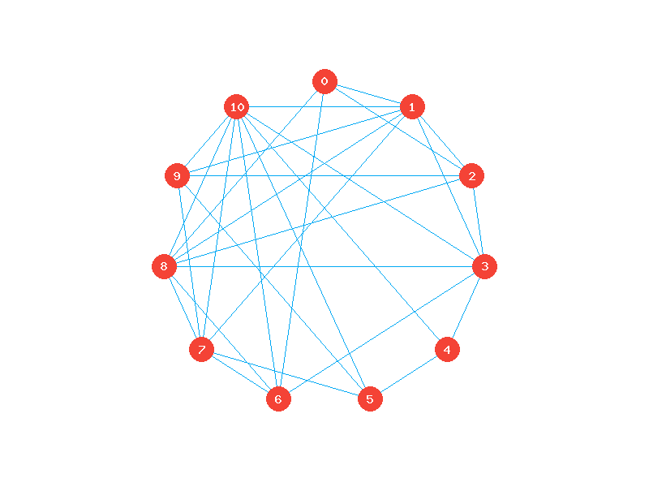
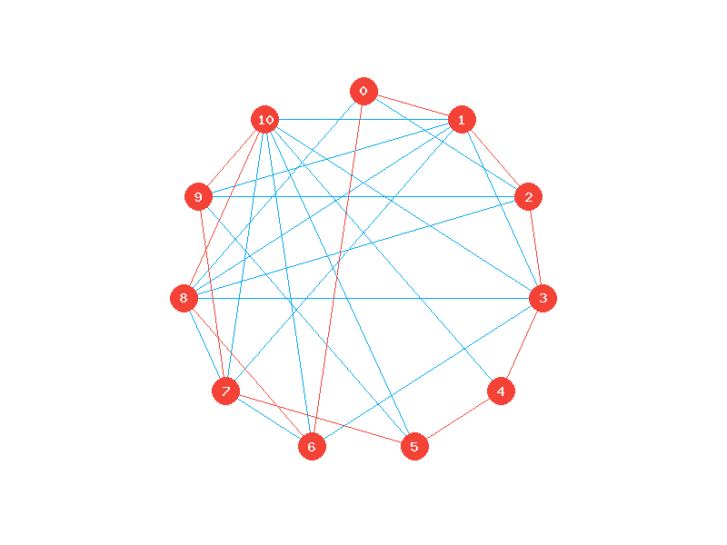
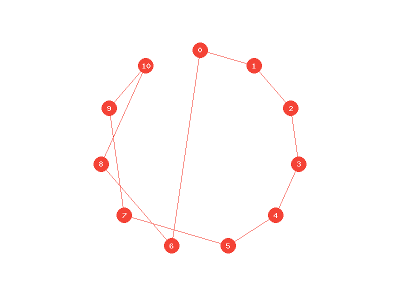
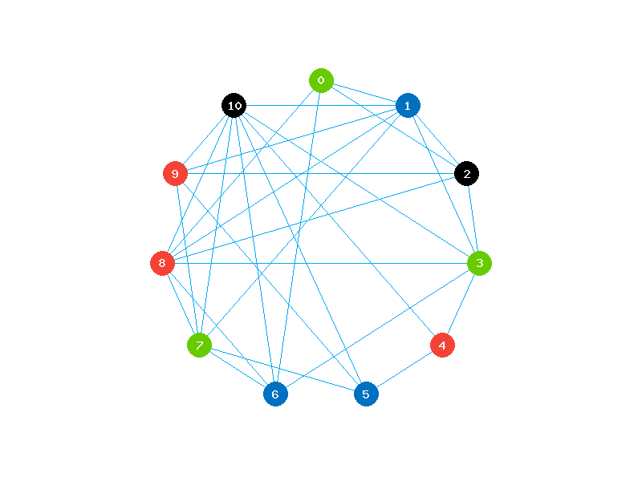
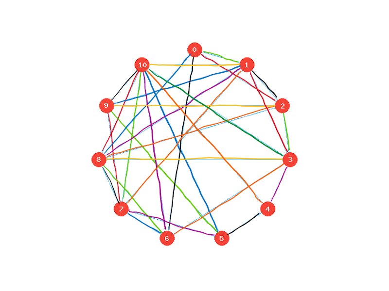
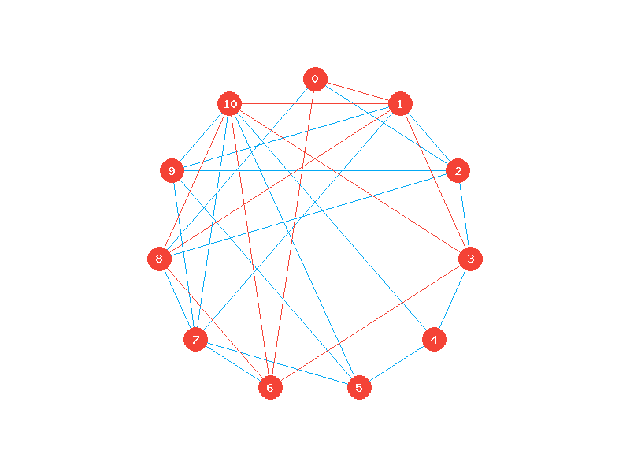
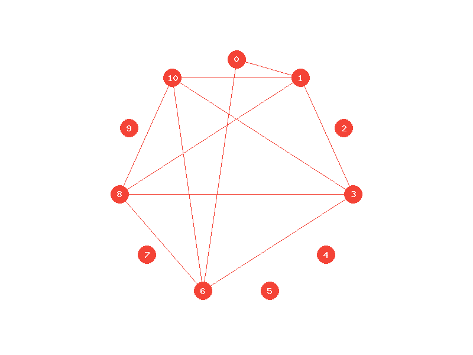
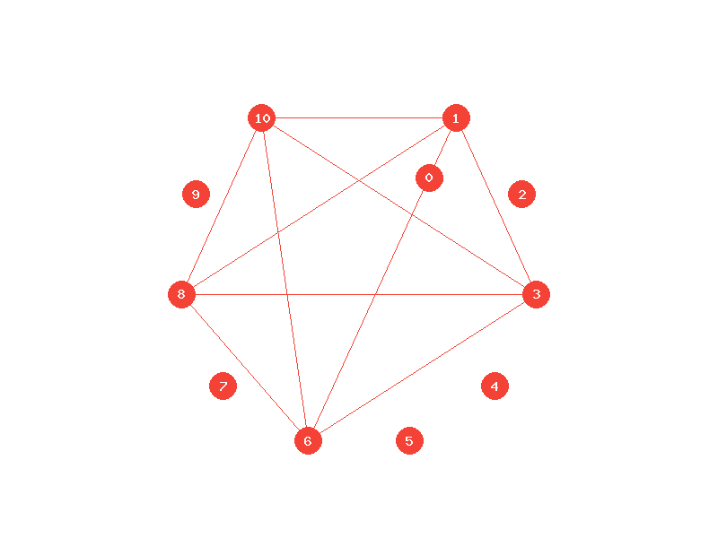

# Część analityczna

## Zadanie 1 (1pkt)

Wykonaj szkic grafu.

## Zadanie 2 (1pkt)

Opisz graf w formie macierzy incydencji.

|     |  1  |  2  |  3  |  4  |  5  |  6  |  7  |  8  |  9  | 10  | 11  | 12  | 13  | 14  | 15  | 16  | 17  | 18  | 19  | 20  | 21  | 22  | 23  | 24  | 25  | 26  | 27  | 28  | 29  | 30  |
| :-: | :-: | :-: | :-: | :-: | :-: | :-: | :-: | :-: | :-: | :-: | :-: | :-: | :-: | :-: | :-: | :-: | :-: | :-: | :-: | :-: | :-: | :-: | :-: | :-: | :-: | :-: | :-: | :-: | :-: | :-: |
|  0  |  1  |  1  |  1  |  1  |  0  |  0  |  0  |  0  |  0  |  0  |  0  |  0  |  0  |  0  |  0  |  0  |  0  |  0  |  0  |  0  |  0  |  0  |  0  |  0  |  0  |  0  |  0  |  0  |  0  |  0  |
|  1  |  0  |  0  |  1  |  0  |  1  |  1  |  1  |  1  |  1  |  1  |  0  |  0  |  0  |  0  |  0  |  0  |  0  |  0  |  0  |  0  |  0  |  0  |  0  |  0  |  0  |  0  |  0  |  0  |  0  |  0  |
|  2  |  1  |  0  |  0  |  0  |  0  |  0  |  1  |  0  |  0  |  0  |  1  |  1  |  1  |  0  |  0  |  0  |  0  |  0  |  0  |  0  |  0  |  0  |  0  |  0  |  0  |  0  |  0  |  0  |  0  |  0  |
|  3  |  0  |  0  |  0  |  0  |  1  |  0  |  0  |  0  |  0  |  0  |  0  |  1  |  0  |  1  |  1  |  1  |  1  |  0  |  0  |  0  |  0  |  0  |  0  |  0  |  0  |  0  |  0  |  0  |  0  |  0  |
|  4  |  0  |  0  |  0  |  0  |  0  |  0  |  0  |  0  |  0  |  0  |  0  |  0  |  0  |  1  |  0  |  0  |  0  |  1  |  1  |  0  |  0  |  0  |  0  |  0  |  0  |  0  |  0  |  0  |  0  |  0  |
|  5  |  0  |  0  |  0  |  0  |  0  |  0  |  0  |  0  |  0  |  0  |  0  |  0  |  0  |  0  |  0  |  0  |  0  |  1  |  0  |  1  |  1  |  1  |  0  |  0  |  0  |  0  |  0  |  0  |  0  |  0  |
|  6  |  0  |  0  |  0  |  1  |  0  |  0  |  0  |  0  |  0  |  0  |  0  |  0  |  0  |  0  |  0  |  1  |  0  |  0  |  0  |  0  |  0  |  0  |  1  |  1  |  1  |  0  |  0  |  0  |  0  |  0  |
|  7  |  0  |  0  |  0  |  0  |  0  |  0  |  0  |  0  |  1  |  0  |  0  |  0  |  0  |  0  |  0  |  0  |  0  |  0  |  0  |  1  |  0  |  0  |  0  |  1  |  0  |  1  |  1  |  1  |  0  |  0  |
|  8  |  0  |  1  |  0  |  0  |  0  |  0  |  0  |  1  |  0  |  0  |  1  |  0  |  0  |  0  |  0  |  0  |  1  |  0  |  0  |  0  |  0  |  0  |  1  |  0  |  0  |  0  |  0  |  1  |  1  |  0  |
|  9  |  0  |  0  |  0  |  0  |  0  |  1  |  0  |  0  |  0  |  0  |  0  |  0  |  1  |  0  |  0  |  0  |  0  |  0  |  0  |  0  |  0  |  1  |  0  |  0  |  0  |  0  |  1  |  0  |  0  |  1  |
| 10  |  0  |  0  |  0  |  0  |  0  |  0  |  0  |  0  |  0  |  1  |  0  |  0  |  0  |  0  |  1  |  0  |  0  |  0  |  1  |  0  |  1  |  0  |  0  |  0  |  1  |  1  |  0  |  0  |  1  |  1  |

## Zadanie 3 (3pkt)

Czy ten graf jest hamiltonowski/pół-hamiltonowski? Jeśli tak to podaj ścieżkę/cykl Hamiltona.

Zadany graf jest grafem hamiltonowskim. Cykl Hamiltona: `0 1 2 3 4 5 7 9 10 8 6 0`

## Zadanie 4 (3pkt)

Czy ten graf jest eulerowski/pół-eulerowski? Jeśli tak, podaj ścieżkę/cykl Eulera.

> Aby istniał cykl Eulera, każdy wierzchołek grafu musi posiadać stopień parzysty.
>
> Aby istniała ścieżka Eulera, każdy wierzchołek grafu za wyjątkiem dwóch musi posiadać stopień parzysty.

W zadanym grafie sześć wierzchołków posiada stopień nieparzysty, co wyklucza istnienie zarówno ścieżki, jak i cyklu Eulera. Zatem graf nie jest eulerowski ani pół-eulerowski

## Zadanie 5 (2pkt)

Pokoloruj graf wierzchołkowo oraz krawędziowo.

### Graf pokolorowany wierzchołkowo

### Graf pokolorowany krawędziowo

## Zadanie 6 (1pkt)

Podaj liczbę chromatyczną oraz indeks chromatyczny dla grafu.

-   Liczba chromatyczna  = 4
-   Indeks chromatyczny  = 8

## Zadanie 7 (1pkt)

Wyznacz minimalne drzewo rozpinające dla analizowanego grafu.

## Zadanie 8 (2pkt)

Czy rysunek tego grafu jest planarny? Jeśli nie, to czy da się go przedstawić jako planarny?
Jeśli tak, to ile ścian można w nim wyznaczyć? Proszę to wykazać na rysunku.

### Twierdzenie Kuratowskiego

> Graf skończony jest planarny wtedy i tylko wtedy, gdy nie zawiera podgrafu homeomorficznego z grafem K5 ani z grafem K3,3.

Zadany podgraf zawiera podgraf homeomorficzny z grafem grafem K5, zatem nie jest grafem planarnym (nie da się go przedstawić na rysunku jako planarny)

---

Wszystkie ilustracje grafów zostały wygenerowane za pomocą skryptu [GraphDraw](https://github.com/sokoloowski/GraphDraw)
